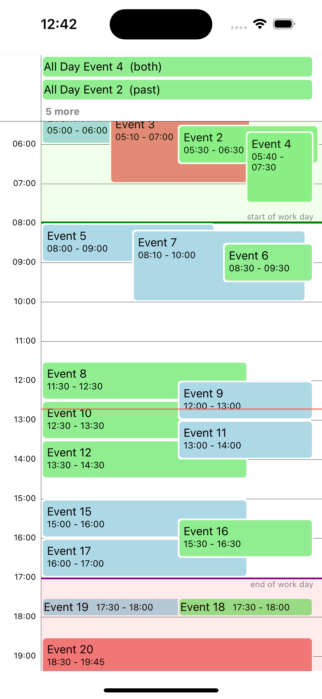

# Event Calendar

## Overview
The Sunsama Event Calendar library is a React Native component designed to display and manage calendar events. It supports multiple calendars, real-time updates, and intuitive gestures for a seamless user experience.

We use this library in the Sunsama mobile app to display and manage events across multiple calendars. It is designed to be highly customizable and easy to integrate into any React Native project.

## Features
- Displays events in a day-view layout.
- Supports multiple calendars.
- Gesture-based event interactions.
- Animated UI with **react-native-reanimated**.
- Compatible with **react-native-gesture-handler**.
- Customizable event styling.
- Editable events with restrictions.
- Timezone support.
- Zoom and drag interactions.
- Supports Expo Go and bare React Native projects.

## Screenshots

<div style="display: flex; justify-content: space-around;">
  <div>
    <h3>iOS</h3>
    
  </div>
  <div>
    <h3>Android</h3>
    
  </div>
</div>

## Installation
To install the library, add it to your project using:

```sh
npm install @sunsama/event-calendar
# or
yarn add @sunsama/event-calendar
```

Ensure the following dependencies are also installed:

```sh
npm install react-native-reanimated react-native-gesture-handler
```

## Usage
For a full implementation example, refer to the **example app** included in the repository.

## Props
| Prop                        | Type                    | Required | Default | Description                                                                                                                        |
|-----------------------------|-------------------------|----------|---------|------------------------------------------------------------------------------------------------------------------------------------|
| `events`                    | `CalendarEvent[]`       | Yes      |         | List of event objects.                                                                                                             |
| `dayDate`                   | `String`                | Yes      |         | The current date of the calendar in ISO string.                                                                                    |
| `renderEvent`               | `Function`              | Yes      |         | Custom renderer for event components.                                                                                              |
| `onCreateEvent`             | `Function`              | No       |         | Callback triggered when a new event is created.                                                                                    |
| `onPressEvent`              | `Function`              | No       |         | Callback triggered when an event is pressed.                                                                                       |
| `userCalendarId`            | `String`                | No       |         | The primary calendar ID for event sorting.                                                                                         |
| `timeFormat`                | `String`                | No       | HH:mm   | Defines the time format used in the calendar. See [moment.js](https://momentjs.com/docs/#/displaying/) documentation for examples. |
| `showTimeIndicator`         | `Boolean`               | No       | False   | Displays a line showing the current time.                                                                                          |
| `canCreateEvents`           | `Boolean`               | No       | True    | Allows users to create new events.                                                                                                 |
| `canEditEvent`              | `Function` or `Boolean` | No       | True    | Determines if an event is editable. You can supply a function to do this deterministically.                                        |
| `maxAllDayEvents`           | `Number`                | No       | 2       | Sets the maximum number of all-day events displayed before showing a 'show more' option.                                           |
| `timezone`                  | `String`                | No       | UTC     | Defines the timezone for event times.                                                                                              |
| `renderDragBars`            | `Object`                | No       |         | Custom drag handles for resizing events.                                                                                           |
| `onEventEdit`               | `Function`              | No       |         | Callback triggered when an event is edited.                                                                                        |
| `theme`                     | `Object`                | No       |         | Allows overriding default calendar themes.                                                                                         |
| `initialZoomLevel`          | `Number`                | No       | 0.8     | Defines the initial zoom level of the calendar.                                                                                    |
| `renderNewEventContainer`   | `Function`              | No       |         | Custom UI for new event creation. If none supplied it will show a semi-transparent bar you can theme.                              |
| `fiveMinuteInterval`        | `Boolean`               | No       | False   | Ensures event snapping to 5-minute increments.                                                                                     |
| `updateLocalStateAfterEdit` | `Boolean`               | No       | True    | Optimistically updates local state after event editing.                                                                            |

## Dependencies
Ensure you have the following dependencies installed for proper functionality:
- `react-native-reanimated`
- `react-native-gesture-handler`
- `react-native-safe-area-context`

## Limitations

This library has been made specifically for the Sunsama mobile app and therefore it is very opinionated. This results in some limitations:
We only support features that are used in the Sunsama app. If you need a feature that is not supported, you can create a PR but we won't add new features unless it brings value to the Sunsama app.
We do fix bugs, however.

## License
This project is licensed under the MIT License.

